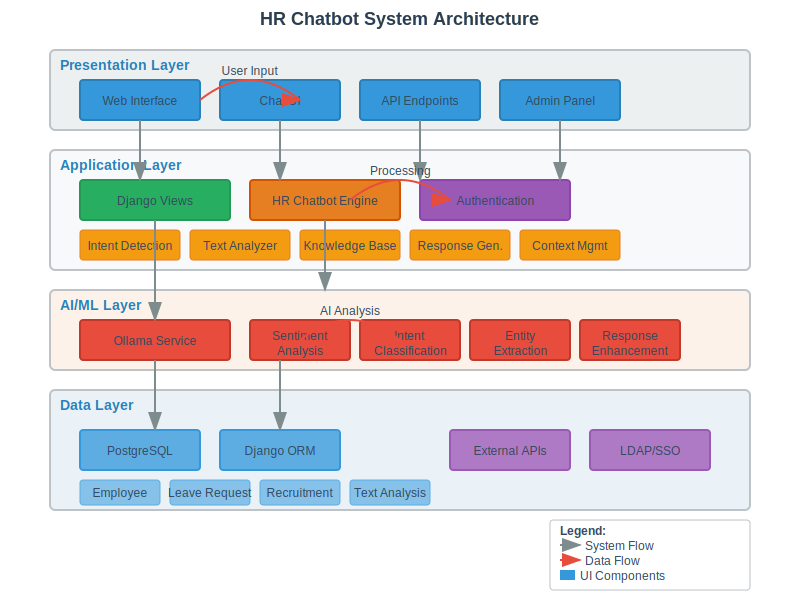

<<<<<<< HEAD
# HR Chatbot System

🤖 **Sistem Chatbot HR Cerdas dengan Dukungan AI/LLM**

Sistem chatbot HR yang canggih dengan dukungan kecerdasan buatan untuk membantu karyawan mendapatkan informasi HR dengan cepat dan akurat.

## ✨ Fitur Utama

- 🗣️ **Multilingual Support** - Mendukung Bahasa Indonesia dan English
- 🧠 **AI-Powered** - Integrasi dengan Ollama (Local LLM) untuk pemahaman konteks yang lebih baik
- 📊 **Intent Recognition** - Deteksi otomatis maksud pengguna dengan akurasi tinggi
- 💬 **Natural Conversations** - Percakapan yang natural dan kontekstual
- 🔐 **Secure & Private** - Data tetap aman dengan processing lokal
- 📈 **Scalable Architecture** - Arsitektur yang dapat berkembang sesuai kebutuhan

## 🚀 Quick Start

### Prasyarat
- Python 3.8+
- Django 4.0+
- Ollama (untuk fitur AI)

### Instalasi Cepat

```bash
# 1. Clone repository
git clone <repository-url>
cd hrcopilot

# 2. Setup virtual environment
python -m venv ai/.venv
source ai/.venv/bin/activate  # macOS/Linux
# ai\.venv\Scripts\activate     # Windows

# 3. Install dependencies
cd horilla
pip install -r requirements.txt

# 4. Setup database
python manage.py migrate
python manage.py createsuperuser

# 5. Install Ollama dan model
brew install ollama  # macOS
ollama pull llama3.2:3b
ollama pull nomic-embed-text

# 6. Jalankan server
python manage.py runserver
```

Akses aplikasi di: `http://localhost:8000`

## 📖 Dokumentasi Lengkap

Untuk panduan instalasi detail, integrasi, arsitektur, dan praktik terbaik, silakan baca:

📋 **[DOCUMENTATION.md](DOCUMENTATION.md)** - Dokumentasi lengkap sistem

## 🏗️ Arsitektur Sistem



Sistem terdiri dari 4 layer utama:
- **Presentation Layer** - Web Interface & API
- **Application Layer** - Business Logic & Chatbot Engine
- **AI/ML Layer** - Ollama Service & NLP Processing
- **Data Layer** - Database & External Services

## 💡 Contoh Penggunaan

### Cek Saldo Cuti
```
User: "Berapa sisa cuti saya?"
Bot: "Halo John! Sisa cuti Anda saat ini adalah 12 hari."
```

### Informasi Rekrutmen
```
User: "How many applicants for software engineer?"
Bot: "There are currently 25 applicants for the Software Engineer position."
```

### Kebijakan Perusahaan
```
User: "Apa kebijakan work from home?"
Bot: "Kebijakan WFH memungkinkan karyawan bekerja dari rumah maksimal 2 hari per minggu..."
```

## 🧪 Testing

```bash
# Test chatbot functionality
python nlp_engine/demo_chatbot_examples.py

# Test Ollama integration
python test_ollama_integration.py

# Django unit tests
python manage.py test
```

## 📁 Struktur Project

```
hrcopilot/
├── horilla/                 # Main Django application
│   ├── nlp_engine/         # Chatbot & NLP components
│   │   ├── chatbot.py      # Main chatbot engine
│   │   ├── ollama_service.py # AI/LLM integration
│   │   ├── text_analyzer.py # Text processing
│   │   └── knowledge_base.py # FAQ & knowledge management
│   ├── employee/           # Employee management
│   ├── leave/              # Leave management
│   └── recruitment/        # Recruitment management
├── ai/                     # AI service components
└── docs/                   # Documentation
```

## 🔧 Konfigurasi

### Environment Variables
```bash
# .env file
OLLAMA_BASE_URL=http://localhost:11434
OLLAMA_GENERATION_MODEL=llama3.2:3b
OLLAMA_EMBEDDING_MODEL=nomic-embed-text
DEBUG=True
```

### Ollama Configuration
```python
# nlp_engine/ollama_config.py
OLLAMA_CONFIG = {
    'temperature': 0.7,
    'max_tokens': 500,
    'enable_sentiment_analysis': True,
    'enable_intent_classification': True,
    'enable_response_enhancement': True
}
```

## 🤝 Contributing

1. Fork repository
2. Buat feature branch (`git checkout -b feature/amazing-feature`)
3. Commit changes (`git commit -m 'Add amazing feature'`)
4. Push ke branch (`git push origin feature/amazing-feature`)
5. Buat Pull Request

## 📝 License

Project ini dilisensikan di bawah [MIT License](LICENSE).

## 🆘 Support

Jika Anda mengalami masalah atau memiliki pertanyaan:

- 📖 Baca [dokumentasi lengkap](DOCUMENTATION.md)
- 🐛 Laporkan bug di [Issues](../../issues)
- 💬 Diskusi di [Discussions](../../discussions)

## 🏆 Acknowledgments

- [Django](https://djangoproject.com/) - Web framework
- [Ollama](https://ollama.ai/) - Local LLM runtime
- [Horilla](https://github.com/horilla-opensource/horilla) - Base HR system

---

**Dibuat dengan ❤️ oleh HR Chatbot Development Team**
=======
# hr-copilot
HR Copilot
>>>>>>> bf3da128326fd40c2734d20d80840e687b9dc642
